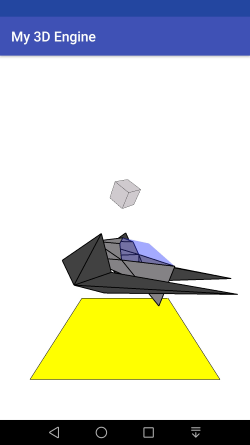

# Test3DEngine
My attempt to make a simple 3D Engine for java-games.

Screenshots
------------

3d physics | Preview
---- | ----
 | 

## Getting Started
```java
// In View

Scene3D scene;
Box box1, box2;
Renderer render;
float angle = 0;

initScene() {
  scene = new Scene3D();
  
  box1 = new Box(10, 10, 10, 0, 30, 0);
  box1.color(150, 150, 150);
  box1.outlineBox(true);
  box1.merge();
  
  box2 = new Box(10, 10, 10, 0, -30, 0);
  box2.color(100, 100, 255);
  box2.outlineBox(true);
  box2.merge();
  
  scene.add(box1);
  scene.add(box2);
  
  render = new Renderer(scene, 1000, 1000);
  render.zHide = -50;
  render.zoom = 7;
}

@Override
protected void onDraw(Canvas canvas) {
  angle += 0.5f;
  box1.setRotation(angle, angle, angle);
  box2.setRotation(angle, angle, angle);
  render.render(canvas);
  
  invalidate();
}
```
For large scenes it is advisable to use SurfaceView.
